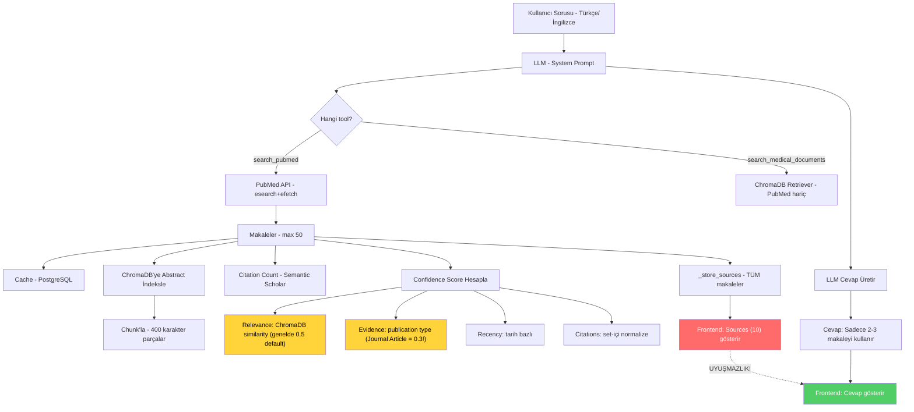

# MedicaLLM — PubMed Araştırma Tool'u Kapsamlı Analizi

**Tarih:** 2026-04-23  
**Analiz Kapsamı:** Backend PubMed tool, RAG pipeline, kaynak yönetimi, frontend kaynak gösterimi  
**İlgili Dosyalar:**  
- [tools.py](file:///c:/Users/unala/projects/MedicaLLM/backend/src/agent/tools.py) — Agent tool tanımları  
- [service.py](file:///c:/Users/unala/projects/MedicaLLM/backend/src/pubmed/service.py) — PubMed API servisi  
- [session.py](file:///c:/Users/unala/projects/MedicaLLM/backend/src/agent/session.py) — Session ve streaming  
- [agent.py](file:///c:/Users/unala/projects/MedicaLLM/backend/src/agent/agent.py) — System prompt & agent  
- [vector_store.py](file:///c:/Users/unala/projects/MedicaLLM/backend/src/rag/vector_store.py) — RAG vector store  
- [Chat.jsx](file:///c:/Users/unala/projects/MedicaLLM/frontend/src/pages/Chat.jsx) — Frontend kaynak gösterimi

---

## Özet: Neden Kaynaklar ile Cevaplar Uyuşmuyor?

Kullanıcının gözlemlediği **"source kısmı ile verilen cevaplar alakasız"** sorununun birden fazla kök nedeni var. Aşağıda tüm bulgular detaylı olarak listeleniyor.

---

## 1. 🔴 KRİTİK: Kaynak-Cevap Bağlantısızlığının Kök Nedenleri

### Sorun 1.1 — LLM, Kaynakları Sentezlerken Sadece "Bazılarını" Kullanıyor

> [!CAUTION]
> **Ana sorun budur.** PubMed tool'u 10 makale döndürür, bunların hepsinin kaynakları (sources) frontend'e gönderilir. Ancak LLM cevap yazarken sadece 2-3 makaleyi kullanabilir veya hiçbirini doğru referanslamayabilir.

**Akış:**
```
Kullanıcı sorusu
    → search_pubmed tool çalışır → 10 makale bulur
    → 10 makalenin hepsi source listesine eklenir (tools.py L605-618)
    → LLM bu 10 makaleden sadece birkaçını cevabında sentezler
    → Frontend, 10 kaynağın hepsini "Sources (10)" olarak gösterir
    → Kullanıcı: "Kaynaklarla cevap uyuşmuyor!"
```

**Dosya:** [tools.py L570-622](file:///c:/Users/unala/projects/MedicaLLM/backend/src/agent/tools.py#L570-L622)

**Sorunun Detayı:**  
`search_pubmed` tool'u çalıştıktan sonra **tüm makaleleri** `_store_sources()` ile kaydeder (L620). Bu kaynaklar doğrudan frontend'e iletilir. Ancak LLM'in cevabında gerçekten hangi kaynakları kullandığı **hiçbir yerde izlenmez**. Kaynaklar ile cevap arasında **hiçbir filtreleme veya eşleştirme mekanizması yoktur**.

---

### Sorun 1.2 — Çoklu Tool Çağrısında Kaynaklar Birbirine Karışıyor

> [!WARNING]
> Agent tek bir sorguda birden fazla tool çağırabilir (örn: `search_medical_documents` + `search_pubmed`). Bu durumda iki farklı tool'un kaynakları **aynı listeye eklenir**.

**Dosya:** [tools.py L94-114](file:///c:/Users/unala/projects/MedicaLLM/backend/src/agent/tools.py#L94-L114)

```python
def _store_sources(sources: Optional[list]) -> None:
    # ...
    existing_cv = _last_search_sources_var.get()
    if existing_cv is None:
        _last_search_sources_var.set(list(sources))
    else:
        existing_cv.extend(sources)  # ← Tüm tool çıktıları birbirine EKLENİR
```

Bu, `search_medical_documents` tool'unun döndürdüğü yerel PDF kaynakları ile `search_pubmed` tool'unun döndürdüğü PubMed makaleleri **aynı listede karışık** olarak gösterilir. Kullanıcı hangi kaynağın hangi bilgiye ait olduğunu anlayamaz.

---

### Sorun 1.3 — Abstract Kırpılarak Source'a Yazılıyor, Ancak Cevap Tam Abstact'a Dayanıyor

**Dosya:** [tools.py L613](file:///c:/Users/unala/projects/MedicaLLM/backend/src/agent/tools.py#L613)

```python
source_entry = {
    # ...
    "content": abstract[:200],  # Sadece ilk 200 karakter
}
```

Frontend'de kaynak kartında gösterilen `content` yalnızca abstract'ın ilk 200 karakteridir. LLM ise **tam abstract** üzerinden cevap üretir. Kullanıcı kısa snippet'i okuduğunda cevapla bağlantı kuramaz.

---

## 2. 🟠 PubMed Veri Çekme Pipeline'ındaki Mantık Hataları

### Sorun 2.1 — Sorgu Dili Çevirisi Yapılmıyor

> [!IMPORTANT]
> Kullanıcı Türkçe soru sorduğunda, bu soru doğrudan PubMed'e Türkçe olarak gönderiliyor. PubMed İngilizce bir veritabanıdır ve Türkçe terimleri anlayamaz.

**Akış:**
```
Kullanıcı: "Kalp yetmezliğinde SGLT2 inhibitörleri ne işe yarar?"
    → LLM tool'u çağırır: search_pubmed(query="SGLT2 inhibitors heart failure")
                                  VEYA
                           search_pubmed(query="kalp yetmezliği SGLT2")  ← YANLIŞ!
```

LLM Türkçeyi İngilizceye çevirip tool'a verebilir, ama bu **garanti değildir**. `openai-gpt-oss-20b` modeli bazı durumlarda Türkçe terimi aynen geçirebilir, bu da PubMed'den alakasız veya boş sonuç dönmesine neden olur.

**Dosya:** [tools.py L456-478](file:///c:/Users/unala/projects/MedicaLLM/backend/src/agent/tools.py#L456-L478) — Tool tanımında query çevirisi yoktur.

---

### Sorun 2.2 — Cache Anahtar Hassasiyeti: Büyük/Küçük Harf Farkı Bile Aynı Sorgu Sayılıyor ama Sıralama Farklı Olabilir

**Dosya:** [service.py L19-25](file:///c:/Users/unala/projects/MedicaLLM/backend/src/pubmed/service.py#L19-L25)

```python
def _normalize_query(query: str) -> str:
    return query.strip().lower()
```

Bu normalizasyon **çok agresif**. "SGLT2 inhibitors in heart failure" ile "heart failure SGLT2 inhibitors" **farklı hash** üretir ama aynı arama sonuçları döner. Aynı konuda farklı sıralamalarla yapılan aramalar cache'i bypass eder ve gereksiz API çağrıları yapar.

---

### Sorun 2.3 — Yinelenen NCBI efetch Çağrısı (Gereksiz Ağ Trafiği)

> [!NOTE]
> `search_pubmed()` fonksiyonu zaten efetch ile makale detaylarını çeker ve `publication_types` alanını doldurur. Ancak `compute_confidence_scores()` tekrar `fetch_publication_types_batch()` çağırır.

**Dosya:** [service.py L134-138](file:///c:/Users/unala/projects/MedicaLLM/backend/src/pubmed/service.py#L134-L138) — esearch sonrası efetch'te `pub_types` zaten çekiliyor:

```python
# Publication types (extract here to avoid redundant efetch later)
pub_types = []
for pt in article_elem.findall(".//PublicationType"):
    if pt.text:
        pub_types.append(pt.text.strip())
```

Ancak [service.py L582-584](file:///c:/Users/unala/projects/MedicaLLM/backend/src/pubmed/service.py#L582-L584):

```python
pmids_needing_types = [a.get("pmid", "") for a in articles 
                       if a.get("pmid") and a.get("publication_types") is None]
pub_types_map = fetch_publication_types_batch(pmids_needing_types) if pmids_needing_types else {}
```

Bu `is None` kontrolü sorunlu — `search_pubmed()` her zaman `publication_types` listesi döndürür (boş olsa bile `[]`). Dolayısıyla `is None` asla true olmaz ve batch efetch asla çağrılmaz. **Bu bir dead code.**

Ancak eğer cache'ten dönen makaleler `publication_types` alanını içermiyorsa (eski cache formatı), o zaman bu kod çalışır ve **ekstra bir efetch** yapılır.

---

### Sorun 2.4 — `add_documents()` PubMed Abstract'ları Gereksiz Yere Tekrar Chunk'lıyor

**Dosya:** [vector_store.py L114-116](file:///c:/Users/unala/projects/MedicaLLM/backend/src/rag/vector_store.py#L114-L116)

```python
def add_documents(self, documents: List[Document]) -> bool:
    pm.deb(f"Adding {len documents} new documents to vector store...")
    return self.add_chunks(self.pdf_processor.split_documents(documents))
```

Bu method, PubMed abstract'ları (genellikle 200-400 kelime) üzerinde `RecursiveCharacterTextSplitter` çalıştırır (chunk_size=400, overlap=100). Zaten kısa olan abstract'lar gereksiz yere bölünür veya overlapping kopyaları oluşturulur. Bu:

1. **ChromaDB'de duplicate chunk'lar** oluşturur
2. **Relevance scoring'de** aynı makalenin farklı chunk'ları farklı skorlar alır → yanıltıcı sonuçlar

---

## 3. 🟡 Confidence Score Hesaplama Hataları

### Sorun 3.1 — Relevance Score PubMed İçin Her Zaman 0.5 (Default)

**Dosya:** [service.py L566-576](file:///c:/Users/unala/projects/MedicaLLM/backend/src/pubmed/service.py#L566-L576)

```python
if query and vector_store_manager:
    try:
        results = vector_store_manager.vectorstore.similarity_search_with_relevance_scores(query, k=20)
        for doc, score in results:
            pmid = doc.metadata.get("pmid", "")
            if pmid and pmid not in relevance_map:
                relevance_map[pmid] = max(0.0, min(1.0, score))
```

Bu kod **yeni eklenen** makalelerin relevance score'unu hesaplamaya çalışır ama **zamanlama sorunu** var:

1. `search_pubmed` tool'u makaleyi ChromaDB'ye ekler (tools.py L543-549)
2. Hemen ardından `compute_confidence_scores()` çağrılır (tools.py L565)
3. ChromaDB'deki embeddings henüz **yeterince olgunlaşmamış** olabilir
4. Daha önemlisi: aramanın kendisi PubMed'den gelen abstract'lar üzerinde yapılıyor ama **chunk'lanmış halini** arıyor — chunk metadata'sında `pmid` alanı her zaman mevcut olmayabilir (özellikle PDF chunk'larında)

Sonuç: Çoğu makale `relevance = 0.5` (default) alır → **confidence score'lar anlamsızlaşır**.

---

### Sorun 3.2 — Citation Count Normalize Edilirken Set İçi Karşılaştırma

**Dosya:** [service.py L578-579](file:///c:/Users/unala/projects/MedicaLLM/backend/src/pubmed/service.py#L578-L579)

```python
max_cites = max((a.get("citation_count", 0) for a in articles), default=1)
```

Normalizasyon **yalnızca mevcut sonuç seti** içinde yapılır. Eğer en yüksek atıf sayısı 5 ise, 5 atıflı makale 100/100 puan alır. 10.000 atıflı bir çalışma ile 5 atıflı çalışma arasındaki **gerçek fark** ortaya çıkmaz. Bu, **set bağımlı normalleştirme** hatasıdır.

---

### Sorun 3.3 — Evidence Level "Journal Article" İçin Tanımsız

**Dosya:** [service.py L456-472](file:///c:/Users/unala/projects/MedicaLLM/backend/src/pubmed/service.py#L456-L472)

PubMed'deki en yaygın publication type **"Journal Article"** dir. Ancak `_EVIDENCE_LEVELS` sözlüğünde bu tip yoktur:

```python
_EVIDENCE_LEVELS = {
    "meta-analysis": 1.0,
    "systematic review": 0.9,
    # ...
    "letter": 0.1,
}
```

**"Journal Article"** `_EVIDENCE_LEVELS`'ta bulunmadığı için `get_evidence_score()` default olarak `0.3` döndürür. Bu, tüm standart araştırma makalelerinin düşük evidence score alması demektir.

---

## 4. 🔵 Tool Orchestration Çelişkileri

### Sorun 4.1 — `search_medical_documents` vs `search_pubmed` Çelişkili Çalışma

> [!WARNING]
> Bu iki tool **aynı ChromaDB vektör veritabanını** kullanıyor ama farklı filtreleri uyguluyor. PubMed tool makaleleri indeksler, sonra `search_medical_documents` bu makaleleri **hariç tutar**.

**Dosya:** [vector_store.py L143](file:///c:/Users/unala/projects/MedicaLLM/backend/src/rag/vector_store.py#L143)

```python
app.state.retriever = vsm.get_retriever(k=3, filter={"source_type": {"$ne": "pubmed"}})
```

Bu demek ki:
- `search_pubmed` → PubMed makalelerini ChromaDB'ye yazar
- `search_medical_documents` → ChromaDB'den okur ama PubMed makalelerini **atlar**
- Confidence score hesabı → ChromaDB'den PubMed makalelerini bulmaya çalışır ama **filtresiz** arar

Çelişki: PubMed makaleleri indeksleniyor ama hiçbir tool bunları verimli şekilde geri çekemiyor. Confidence scoring'deki similarity search, chunk'lara bölünmüş abstract'ları buluyor ama bunların PMID'si eksik olabilir.

---

### Sorun 4.2 — Multi-Tool Çağrısında Son Tool'un Source'u Diğerlerini Eziyor (Streaming Path)

**Dosya:** [session.py L286-294](file:///c:/Users/unala/projects/MedicaLLM/backend/src/agent/session.py#L286-L294)

```python
elif event_type == "on_tool_end":
    if not tool_result:                    # ← Sadece İLK tool sonucu kaydedilir
        data = event.get("data", {})
        tool_result = data.get("output")
```

`tool_result` sadece ilk tool çağrısının sonucunu saklar. Agent birden fazla tool çağırdığında (örn: `search_pubmed` + `recommend_alternative_drug`), yalnızca ilk tool'un sonucu kaydedilir. Ancak `_store_sources` her tool'dan gelen kaynakları biriktirir → **sonuç tutarsızlığı**.

---

### Sorun 4.3 — System Prompt "Source Listesi Ekleme" Talimatı Çelişkili

**Dosya:** [agent.py L95](file:///c:/Users/unala/projects/MedicaLLM/backend/src/agent/agent.py#L95)

```
- Do NOT include a "Sources" or "References" list at the end of your response — 
  the system displays sources automatically in a separate section. 
  Just cite them naturally within your text.
```

LLM'e "kaynakları doğal şekilde cevap içinde belirt" deniyor, ama LLM bunu yapmayabilir. LLM kendi çıktısında PMID'leri veya makale isimlerini belirtmediğinde, frontend'deki kaynak listesi tamamen bağlamsız kalır.

Ayrıca LLM bazen bu talimatı görmezden gelip kendi "References" listesi oluşturuyor → **çifte kaynak listesi** ortaya çıkıyor.

---

## 5. 🟣 Mimari ve Yapısal Zayıflıklar

### Sorun 5.1 — PubMed Sonuçları LLM Context Window'u Aşabilir

**Dosya:** [tools.py L479-480](file:///c:/Users/unala/projects/MedicaLLM/backend/src/agent/tools.py#L479-L480)

```python
num_articles = max(1, min(num_articles, 50))  # Maks 50 makale
```

Her makale ortalama 300 kelimelik abstract içerir. 50 makale × 300 kelime = ~15.000 kelime = ~20.000 token. Bu, `openai-gpt-oss-20b` modelinin context window'unu zorlayabilir. Model context'in sonundaki makaleleri **görmezden gelebilir** (lost-in-the-middle problemi) veya halüsinasyon üretebilir.

---

### Sorun 5.2 — Model Kapasitesi: `openai-gpt-oss-20b` Yetersizliği

> [!IMPORTANT]
> Proje `openai-gpt-oss-20b` kullanıyor (config'te default `openai-gpt-oss-120b`). 20B parametreli açık kaynak model, karmaşık tıbbi sentezleme ve çoklu kaynak karşılaştırması için **yetersiz kalabilir**.

20B model:
- Uzun abstract listelerini iyi sentezleyemez
- Kaynakları karıştırabilir (Makale A'nın bilgisini Makale B'ye atfedebilir)
- Türkçe talimatları tam anlayamayabilir → yanlış tool parametreleri

---

## Çözüm Önerileri Özeti

| # | Sorun | Öncelik | Önerilen Çözüm |
|---|-------|---------|----------------|
| 1.1 | Tüm kaynaklar gönderilir, LLM sadece bazılarını kullanır | 🔴 Kritik | LLM cevabında geçen PMID'leri parse ederek kaynakları filtrele |
| 1.2 | Multi-tool kaynaklar karışır | 🔴 Kritik | Kaynakları tool bazında grupla (`pubmed_sources`, `rag_sources`) |
| 1.3 | Source snippet çok kısa | 🟡 Orta | Snippet'i 500 karaktere çıkar veya anahtar cümleleri göster |
| 2.1 | Türkçe sorgu PubMed'e gider | 🔴 Kritik | Tool'a İngilizce çeviri adımı ekle veya system prompt'ta zorunlu kıl |
| 2.2 | Cache key hassasiyeti | 🟡 Orta | Query normalizasyonunda kelime sıralama ekle |
| 2.3 | Yinelenen efetch | 🟢 Düşük | Dead code temizliği |
| 2.4 | Abstract gereksiz chunk'lanıyor | 🟠 Yüksek | PubMed abstract'ları chunk'lamadan direkt ekle |
| 3.1 | Relevance her zaman 0.5 | 🟠 Yüksek | Relevance scoring'i PubMed-arası cosine similarity ile yap |
| 3.2 | Set-bağımlı citation normalizasyonu | 🟡 Orta | Global log-scale normalizasyon kullan |
| 3.3 | "Journal Article" tanımsız | 🟠 Yüksek | `_EVIDENCE_LEVELS`'a `"journal article": 0.5` ekle |
| 4.1 | ChromaDB filtre çelişkisi | 🟠 Yüksek | PubMed indeksleme stratejisini yeniden tasarla |
| 4.3 | System prompt çelişkisi | 🟡 Orta | Prompt'u netleştir: ya inline cite zorunlu ya da source listesi kaldır |
| 5.2 | 20B model yetersizliği | 🔴 Kritik | `openai-gpt-oss-120b` veya daha güçlü modele geç |

---

## Veri Akışı Diyagramı



---

## Sonuç

PubMed araştırma tool'undaki temel sorun **kaynak-cevap bağlantısızlığıdır**. Tool tüm bulunan makaleleri kaynak olarak kaydeder, ancak LLM bunların sadece bir kısmını kullanır. Frontend ise filtreleme yapmadan tüm kaynakları gösterir. Bu, kullanıcıda "kaynaklar alakasız" izlenimi yaratır.

İkincil sorunlar arasında Türkçe sorgu çevirisi eksikliği, confidence scoring'deki default değerler, ve model kapasitesinin yetersizliği öne çıkmaktadır.
